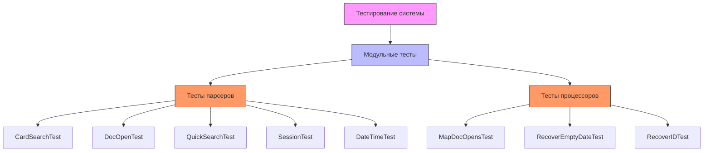

# Парсер пользовательских логов системы КонсультантПлюс

Проект для обработки и анализа логов пользовательских сессий системы КонсультантПлюс

## 📌 Архитектура проекта



## 📊 Выходные данные

```
Document ACC_45616 was searched in cards 24 times

Date,DocID,Count

------------------
05.03.2020,ACC_45615,14
16.03.2020,ACC_45616,14
21.04.2020,ACC_45615,13
23.09.2020,ACC_45614,12
13.03.2020,ACC_45616,12
```

- **Подсчет количества раз, когда в карточке производили поиск документа с идентификатором ACC_45616**:
    - Вывод в консоль
    - Результат: **24**


- **Подсчет статистики открытий документов по дням**:
    - Результат доступен в файле `task2.csv`

